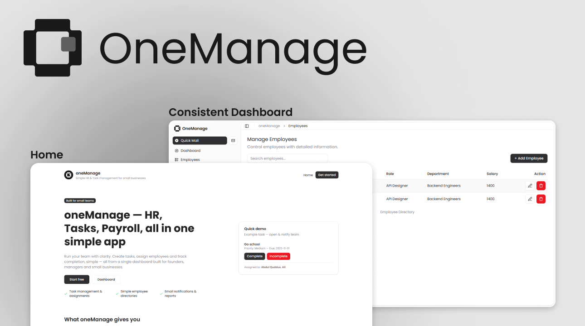

  
  

# OneManage

OpenSource Employee Management System specifically design for Small Businesses and Companies that grow Industries with ease access of Web Application.
[one-manage.vercel.app](https://one-manage.vercel.app/)

## Tech Stack
1. Typescript, TSX
2. NodeJS v24
3. Node Package Manager
4. ReactJS 19
5. NextJS lts
6. Shadcn UI lts
7. Clerk Authentication/Authorization
8. MongoDB -> postgresql

## Deployment Stack
1. Vercel (Frontend/functions)
2. Mongo Atlas (mongoDB) -> SupabaseDB 

## Collaboration Criteria
It is important to show the oneManage is open to `contribution`. The main thing how you adjust the PRs, Issues and Discussions etc. It is restricted to disrespect contributors and another who is related to oneManage clan.

### Issues
Writing Issues must be started with Type Labels. `feat: , bug:, inh: , ingrate:` <title>.
Description must have Proof using screen shot, screen records.

### Pull Request
The important in pull request if you solve it working in existing open issue then use commit title in format like `solved Close #number <type> issue`. 

>[!WARNING]
>It has unstable versions that is not released official because of partial development. It should be done by openSource Collaboration.

